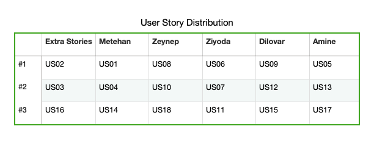

# Welcome

    User stories: US02, US03 and US16, are up for grabs.

# Naming convention:
if you see same functionality name: share the page and communicate with each other

      Feature file: US01_functionalityName_nameInitials.feature
      EX:           US12_customerInfo_OC.feature
      
      Pages class:  PageName_page_nameInitials.java
      EX:           CustomerInfo_page_OC.java
      
      Step Definition: FunctionalityName_stepDef_nameInitials.java
      EX:              CustomerInfo_stepDef_OC.java

      GIT branch name: FirstName
      EX:              Metehan

      TC in Jira: US#AC# summary
      EX:         US12AC1 - Users should see 8 filter items on the Accounts page 

# GIT FLOW:
            Branch that we will push changes: master branch
- write your codes
- do commits
- after last commit
- update your own feature branch (	“fetch” - update and merge master into local own branch)
- then you push from your local branch to your origin(remote) branch
- On GIT create a pull request(base:master, compare:yourBranch) from your origin branch to master branch
- then assign your assignee(communicate to them(send a discord message))

# important
- do not push to and from "master" branch
- do not touch the utilities (stays as it is)
- try not to checkout to master branch

